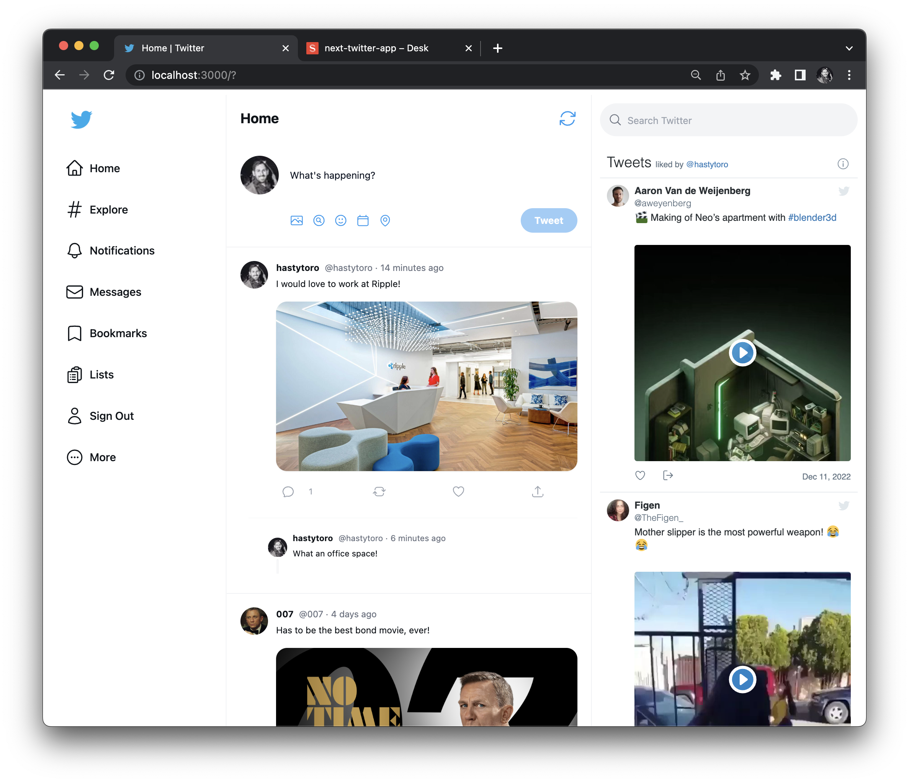

## Twitter clone (with sanity.io)

> A blogging webapp demonstrating the interaction with sanity and Next.js.



Featuring:

- A [Next.js](https://nextjs.org/) project bootstrapped with [`create-next-app`](https://nextjs.org/docs/api-reference/create-next-app).
- Added tailwindcss support by following the [Install Tailwind CSS with Next.js](https://tailwindcss.com/docs/guides/nextjs) guide.

A CSS grid columns out the main layout, breakpoints & spans component as needed.

```jsx
<main className="grid grid-cols-9">
  <SideBar />
  <Feed tweets={tweets} />
  <Widgets />
</main>
```

- All tweets/posts are managed in a [sanity](https://github.com/sanity-io/next-sanity) backend.
- Configuration in the `sanity.js` file exports hooks like `sanityClient` used to query the sanity service.

We pre-render props at the server-side with `getServerSideProps`.

```js
export const getServerSideProps: GetServerSideProps = async (context) => {
  const tweets = await fetchTweets();
  return {
    props: {
      tweets: tweets,
    },
  };
};
```

The helper function returns a promise from the local `pages/api` folder.

```js
// Fetch form the `pages/api` folder and getTweets endpoint.
export const fetchTweets = async () => {
  const res = await fetch(`${process.env.NEXT_PUBLIC_BASE_URL}/api/getTweets`);
  const data = await res.json();
  const tweets = data.tweets;
  return tweets;
};
```

The endpoint `pages/api/getTweets` makes use of the `sanityClient` function.

```js
import { groq } from "next-sanity";
import { client } from "../../sanity";
const feedQuery = groq`
* [_type == 'tweet'&& !blockTweet] {
  _id,
  ...
} | order(_createdAt desc)
`;

export default async function handler(req, res) {
  const tweets = await client.fetch(feedQuery);
  res.status(200).json({ tweets }); // return tweets object in response
}
```

Dependencies:

```json
"dependencies": {
  "@heroicons/react": "^2.0.13",
  "@portabletext/react": "^2.0.0",
  "@sanity/client": "^3.4.1",
  "@sanity/image-url": "^1.0.1",
  "@types/node": "18.11.11",
  "@types/react": "18.0.26",
  "@types/react-dom": "18.0.9",
  "eslint": "8.29.0",
  "eslint-config-next": "13.0.6",
  "next": "13.0.6",
  "next-auth": "^4.18.5",
  "next-sanity": "^3.1.3",
  "react": "18.2.0",
  "react-dom": "18.2.0",
  "react-hot-toast": "^2.4.0",
  "react-timeago": "^7.1.0",
  "react-twitter-embed": "^4.0.4",
  "tailwind-scrollbar-hide": "^1.1.7",
  "typescript": "4.9.3"
},
```

- [Mutation](https://www.sanity.io/docs/http-mutations) we modify documents directly using the HTTP-api.

The mutation API lets you create and modify documents. All requests have to be
authenticated. The APIs transactional. You can submit an array of mutations and
if the operation succeeds you can rest assured that every mutation you submitted
was executed. A transaction may look like this:

```js
{
  "mutations": [
    {"createOrReplace": {
        "_id": "person-1",
        "_type": "person",
        "name": "John Appleseed"
    }},
    {"createOrReplace": {
        "_id": "person-2",
        "_type": "person",
        "name": "Carrie Anderton"
    }}
  ]
}
```

The following mutation types exist in Sanity: `create`, `createOrReplace`, `createIfNotExists`, `delete`, `patch`

Regards, <br />
Luigi Lupini <br />
<br />
I ❤️ all things (🇮🇹 / 🛵 / ☕️ / 👨‍👩‍👧)<br />

This is a [Next.js](https://nextjs.org/) project bootstrapped with [`create-next-app`](https://github.com/vercel/next.js/tree/canary/packages/create-next-app).

## Getting Started

First, run the development server:

```bash
npm run dev
# or
yarn dev
```
